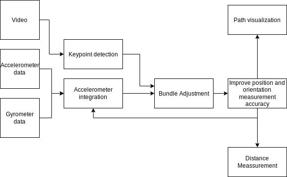
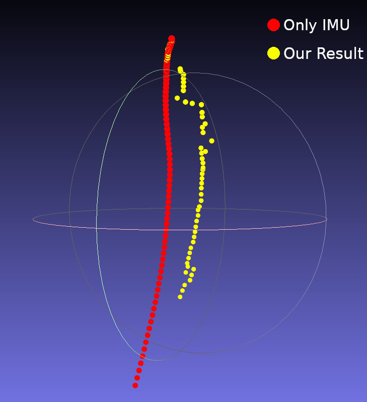
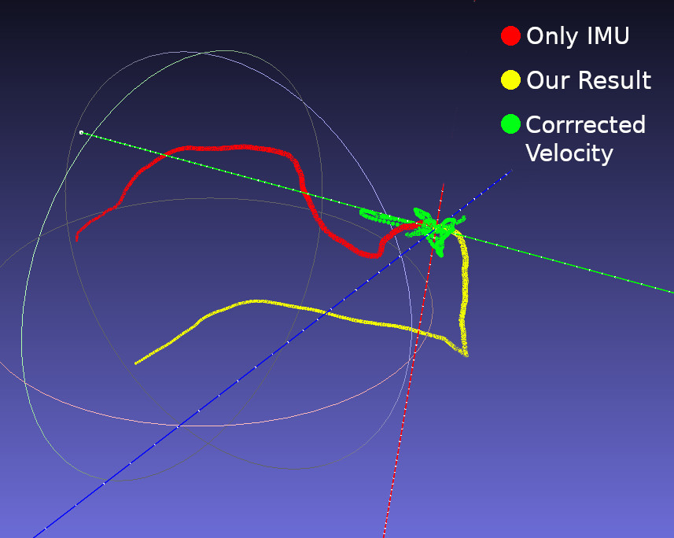

# Camera Path Calculation using

# IMU sensors

```
Jochen Jacobs, Md Jamiur Rahman, Ahnaf Munir, and Oushesh Haradhun
```
## 1 Abstract

Modern mobile phones are equipped with accelerometers and gyroscopes. Data obtained
from the accelerometer can be used to estimate the position of the camera between frames
of a video while the orientation can be determined from the gyroscope. An approximation
of the camera path can be calculated from the combination of these data. However, the
output of this process can be fairly inaccurate. To improve the approximation we use
the IMU data as the input of a Bundle Adjustment. The Bundle Adjustment gives an
improved position and orientation data of the camera for each frame which in turn gives
a better camera path estimation.

## 2 Methodology

The first step in our project is to obtain the IMU data required for the Bundle Ad-
justment. We use a recording app^1 to obtain the data by ourselves. We then detect
the keypoints and compute their descriptors in each video frame using ORB. Keypoint
matching is also performed in this step to identify the unique keypoints. The accelerom-
eter provides us with the acceleration of the camera. We calculate the velocity and
position of the camera from this data. The gyroscope, on the other hand, gives us the
angular velocity which is used to calculate the orientation of the camera. The values ob-
tained from the first two video frames are used to initialize the local Bundle Adjustment
process. For each of the subsequent frames, the Bundle Adjustment outputs a corrected
position and orientation value of the camera (see [1, 2]). These values are then used as
the input for the Bundle Adjustment of the next frame. Performing this process over all
the video frames gives us na approximation of the camera path which is fairly accurate.
An overview of the entire process is illustrated in figure 1.


## 3 Problems and Possible Errors

We encountered multiple problems during the project that finally resulted in the output
to not be usable. Firstly, recording synchronized IMU data and video is difficult. Our
recording app has not been updated in 5 years and its output is not exactly synchronized.
Especially when short and fast rotations are recorded, a difference of one second between
IMU data and video results in significant discrepancies between the bundle adjustment
and the IMU data. Secondly, the IMU sensors in smartphones are very inaccurate
because of noise and its units of measurement are not specified because we did not
calibrate the IMU. This also results in gravity correction to be difficult. Finally, the
quality of our key-point matching is not ideal, which leads to large outliers in the bundle
adjustment results. We try to solve this problem by discarding bundle adjustment results
that differ too much from the IMU data and only using the result for 10% of the final
position, but this leads to the results close to the IMU data without much improvement.
The usage of an uncalibrated camera also increased the complexity of the problem.

## 4 Experiments and Results

We applied our algorithm to a number of recordings:

Distance measurement We moved the camera from one specified position to another
at a known distance, while doing some other movement in between. We hoped to be able
to measure the accuracy of the distance between the start and end positions. However,
the uncalibrated IMU causes an undefined scale. The top-left image in figure 2 shows
the setup used while the bottom-left image shows the measurement result.

Stationary We kept the camera stationary during the entire recording. This was done
to determine the accuracy of the IMU and the bundle adjustment algorithm. You can
see the result in the top-right image in figure 2. As we do not have any scaling which
causes the gravity removal difficult. You can see that the position moved downward over
time though the camera is stationary. The bundle adjustment sometimes corrected the
error.

Staircase We recorded the path in a staircase moving down by two floors. Our hope
was to evaluate the alignment between different floors. The bottom-right image in figure
2 shows the results. Unfortunately, the results were inconclusive. We also tried to correct
the velocity of the IMU-Integration using the results from the bundle adjustments (green
dots). However, this did not result in an improvement.

## References

[1] Gaurav Gupta, Nishant Kejriwal, Prasun Pallav, Ehtesham Hassan, Swagat Kumar, and
Ramya Hebbalaguppe. Indoor Localisation and Navigation on Augmented Reality Devices.
In2016 IEEE International Symposium on Mixed and Augmented Reality (ISMAR-Adjunct),
pages 107–112. IEEE, sep 2016.

[2] E. Mouragnon, M. Lhuillier, M. Dhome, F. Dekeyser, and P. Sayd. Generic and real-
time structure from motion using local bundle adjustment. Image and Vision Computing,
27(8):1178–1193, jul 2009.






Figure 2: Our Experiments and Results. Top-Left: Distance measurement setup;
Botton-Left:Distance measurement result;Top-Right:Stationary measure-
ment result;Botton-Right:Staircase measurement result
